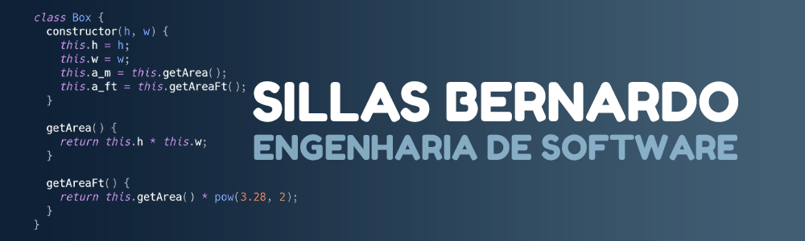

  
  

### 
I'm Sillas, a web developer and designer 👩‍💻
  
  

- 🔭 I’m currently working as IT Manager  
  

- 🌱 I’m currently learning Angular, Python, DevOps and MySQL  
  

- ⚡ Software Engineering at Cruzeiro do Sul  
  

   

## My Skill Set  
<table><tr><td valign="top" width="33%">

### Frontend  

  
  
  
  
  
  
  
  
  
  
  

</td><td valign="top" width="33%">

### Backend  

  
  
  
  
  
  
  
  

</td><td valign="top" width="33%">

### Graphics Design  

  
  
  
  
  
  
  

  

### Extras  

  
  
  
  
  
  
  
  

</td></tr></table>    

   

## Connect with me  

  

  
  

   

## Github Stats  
  

  

   

  

   

  

   

  
  

   

 

----

Generated using <a href="https://profilinator.rishav.dev/" target="_blank">Github Profilinator</a>

